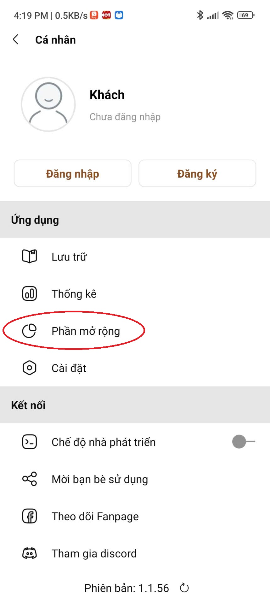
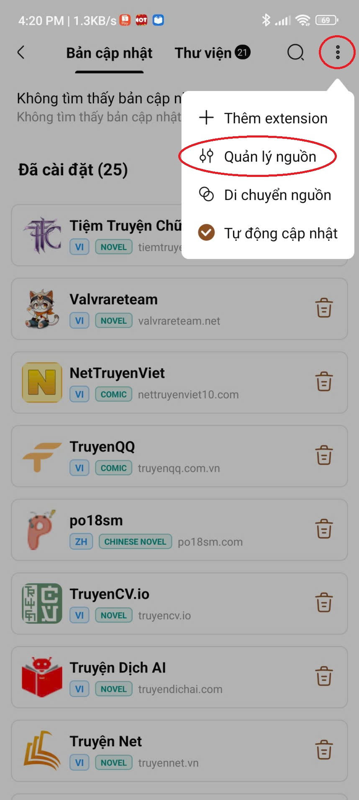

# Vbook Extensions

## 📦 Danh sách Extensions

| STT | Tên Extension | Loại | Ngôn ngữ | Website | Version |
|:---:|:-------------:|:----:|:--------:|:-------:|:-------:|
| 1 | Tiệm Truyện Chữ | Truyện chữ | Tiếng Việt | https://tiemtruyenchu.com | v9 |
| 2 | NetTruyen | Truyện chữ | Tiếng Việt | https://nettruyen.com.vn | v2 |
| 3 | Truyện Net | Truyện chữ | Tiếng Việt | https://truyennet.vn | v3 |
| 4 | Truyện Dịch AI | Truyện chữ | Tiếng Việt | https://truyendichai.com | v3 |
| 5 | TruyenCV.io | Truyện chữ | Tiếng Việt | https://truyencv.io | v2 |
| 6 | Valvrareteam | Truyện chữ | Tiếng Việt | https://valvrareteam.net | v2 |
| 7 | Sói Xám (Fanqie) | Truyện chữ | Tiếng Trung | https://api.langge.cf | v13 |
| 8 | po18sm | Truyện chữ | Tiếng Trung | https://www.po18sm.com | v4 |
| 9 | TruyenQQ | Truyện tranh | Tiếng Việt | https://truyenqq.com.vn | v2 |
| 10 | NetTruyenViet | Truyện tranh | Tiếng Việt | https://nettruyenviet10.com | v2 |
| 11 | HentaiVN 🔞 | Truyện tranh | Tiếng Việt | https://www.hentaivnx.com | v1 |
| 12 | WebtoonScan 🔞 | Truyện tranh | Tiếng Anh | https://webtoonscan.com | v3 |

## ⬇️ Download

### 🤖 Android
- **Bản ổn định:**  
  👉 https://vbookapp.com/download  

- **Bản Beta:**  
  👉 https://t.me/vbook_beta_up_tracker_chanhnh  
  > Nhận thông báo cập nhật và file cài đặt mới nhất tại kênh này.
  
### 🍎 iOS
- **Bản ổn định:**  
  ❌ Không có 

- **Bản Beta:**  
  👉 https://t.me/vbook_beta_up_tracker_chanhnh  
  > Nhận thông báo cập nhật và file cài đặt mới nhất tại kênh này.

### 💻 Desktop
- **Windows:** ⏳ Đang cập nhật  
- **Mac:** ⏳ Đang cập nhật  
- **Linux:** ⏳ Đang cập nhật  


## 🔗 Link nguồn

```
https://raw.githubusercontent.com/WillSun28/vbook-extensions/refs/heads/main/plugin.json
```

## 🔧 Cách thêm nguồn truyện

| 1. Chọn phần mở rộng ở mục cá nhân | 2. Ấn vào dấu ⋮ và chọn quản lý nguồn | 3. Chọn dấu + và dán link nguồn |
|:-------------------:|:--------------------:|:----------------------------:|
|  |  |  |

